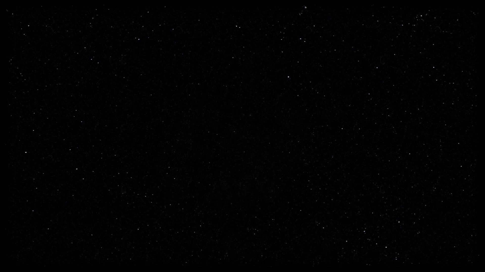

# HAND SYNTH

A hand gesture controlled music synthesizer. Use your webcam to detect hand gestures and play music in real time — no keyboard, no MIDI controller, just your hands.

Built with **PyQt6**, **MediaPipe**, **TensorFlow**, and **NumPy** audio synthesis.


---

## How It Works

```
Webcam --> MediaPipe Hand Detection --> Gesture Classification --> Sound Synthesis --> Speaker
```

1. **Webcam** captures your hands in real time
2. **MediaPipe** detects hand landmarks and identifies left/right hands
3. **Gesture classifier** counts fingers (rule-based or CNN model)
4. **Synthesizer** generates waveforms based on detected gestures
5. **Audio engine** plays the sound through your speakers

---

## Gesture Controls

### Right Hand — Melody (Note Selection)

| Fingers | Gesture    | Note |
|---------|------------|------|
| 0       | Fist       | Silence |
| 1       | 1 Finger   | C |
| 2       | 2 Fingers  | D |
| 3       | 3 Fingers  | E |
| 4       | 4 Fingers  | G |
| 5       | Open Palm  | A |

### Left Hand — Sound Control (Waveform + Octave)

| Fingers | Gesture    | Effect |
|---------|------------|--------|
| 0       | Fist       | Sine, Octave 4 (default) |
| 1       | 1 Finger   | Sine, Octave 3 (low) |
| 2       | 2 Fingers  | Sine, Octave 4 (mid) |
| 3       | 3 Fingers  | Sine, Octave 5 (high) |
| 4       | 4 Fingers  | Square wave, Octave 4 |
| 5       | Open Palm  | Sawtooth wave, Octave 4 |


---

## Project Structure

```
HandSynth/
|-- app.py                    # Main application (PyQt6 UI)
|-- requirements.txt          # Python dependencies
|
|-- src/
|   |-- config.py             # Gesture mappings, audio & camera settings
|   |-- gesture.py            # Hand detection (MediaPipe + CNN)
|   |-- synth.py              # Waveform generation (sine, square, sawtooth)
|   |-- audio.py              # Real-time audio engine (sounddevice)
|
|-- training/
|   |-- collect_data.py       # Webcam-based dataset collection tool
|   |-- model.py              # CNN architecture definition
|   |-- train_model.py        # Training script
|
|-- models/                   # Trained model files (generated, gitignored)
|   |-- gesture_model.keras
|   |-- gesture_model.tflite
|
|-- dataset/                  # Training images (generated, gitignored)
    |-- left/
    |   |-- 0/ 1/ 2/ 3/ 4/ 5/
    |-- right/
        |-- 0/ 1/ 2/ 3/ 4/ 5/
```

---

## Setup

### Prerequisites

- Python 3.10+
- A webcam
- GPU recommended but not required (runs fine on CPU)

### Installation

```bash
# Clone the repo
git clone https://github.com/mml121/HandSynth-IAI.git
cd HandSynth-IAI

# Create virtual environment
python -m venv .venv

# Activate it
# Windows:
.venv\Scripts\activate
# Linux/Mac:
source .venv/bin/activate

# Install dependencies
pip install -r requirements.txt
```

### Run the App

```bash
python app.py
```

Click **START** to begin — the webcam feed appears on the left, controls on the right. Hold up fingers to play notes.


---

## Detection Modes

### Rules Mode (Default)

Uses MediaPipe hand landmarks to count extended fingers by comparing fingertip vs. joint positions. No training needed — works out of the box.

### CNN Mode (Optional)

Uses a lightweight CNN (3 conv layers, ~64x64 grayscale input) trained on your own hand images. More robust but requires collecting a custom dataset first.

The **MODE** button in the UI toggles between the two. It is greyed out if no trained model exists.

---

## Training the CNN Model

### Step 1: Collect Data

```bash
python -m training.collect_data
```

A webcam window opens with on-screen controls:

| Key     | Action |
|---------|--------|
| `0`-`5` | Select which finger count class to record |
| `L`     | Switch to recording LEFT hand |
| `R`     | Switch to recording RIGHT hand |
| `SPACE` | Start / stop collecting images |
| `Q`     | Quit |

Aim for **200-400 images per class per hand**. Move your hand around, vary angles and distances.


### Step 2: Train

```bash
python -m training.train_model
```

This will:
- Load images from `dataset/left/` and `dataset/right/`
- Train for up to 15 epochs (with early stopping)
- Save `models/gesture_model.keras` and `models/gesture_model.tflite`

The TFLite model is used at runtime for faster inference.

---

## UI Overview

The interface uses a **neon-green cyberpunk** aesthetic on a black background.

| Element | Description |
|---------|-------------|
| **Camera Feed** | Live webcam with hand landmark overlay (left side) |
| **HAND SYNTH Title** | Neon green header |
| **Right Hand Status** | Shows detected gesture for the right hand |
| **Note Circle** | Displays the current note being played with a glow effect |
| **Frequency Display** | Shows the frequency in Hz |
| **Left Hand Status** | Shows waveform and octave from the left hand |
| **Volume Slider** | Adjusts output volume |
| **START / STOP** | Camera control buttons |
| **MODE: RULES / CNN** | Toggle detection mode |
| **Guide Bar** | Quick reference for gesture mappings |



---

## Waveforms

The synthesizer generates three waveform types using NumPy:

| Waveform | Sound Character |
|----------|----------------|
| **Sine** | Smooth, pure tone |
| **Square** | Harsh, buzzy, retro |
| **Sawtooth** | Bright, edgy, rich harmonics |

---

## Tech Stack

| Component | Technology | Version |
|-----------|-----------|---------|
| UI Framework | PyQt6 | 6.11.0 |
| Hand Detection | MediaPipe | 0.10.9 |
| CNN Model | TensorFlow / TFLite | 2.19.1 |
| Computer Vision | OpenCV | 4.13.0.92 |
| Audio Synthesis | NumPy + sounddevice | 2.1.3 / 0.5.5 |
| ML Utilities | scikit-learn | 1.8.0 |
| Visualization | matplotlib | 3.10.8 |

---

## Performance Notes

- Targets **30 FPS** webcam processing
- TFLite inference is ~10x faster than Keras `.predict()`
- Predictions are smoothed over a 5-frame sliding window to reduce flicker
- Audio uses a continuous `sounddevice` output stream with phase-tracked transitions for click-free note changes
- Tested on **NVIDIA GTX 1650 (4GB)**

---

## Adding Screenshots

To complete this README with real screenshots, take the following and save them in `screenshots/`:

1. **`app-ui.png`** — The app window at startup (before camera is started)
2. **`app-running.png`** — The app with camera running and a note playing
3. **`gesture-demo.png`** — Close-up showing hand detection with landmarks
4. **`data-collection.png`** — The data collector window during recording
5. **`ui-layout.png`** — Annotated screenshot of the full UI layout

---

## License

This project was built as a university coursework project.
